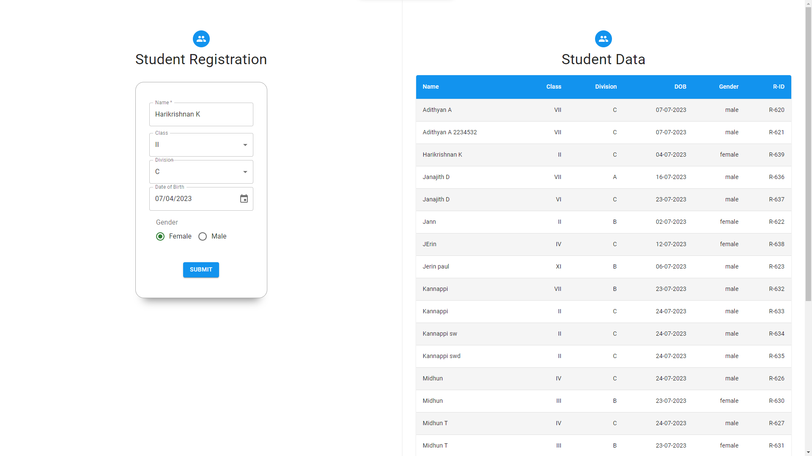
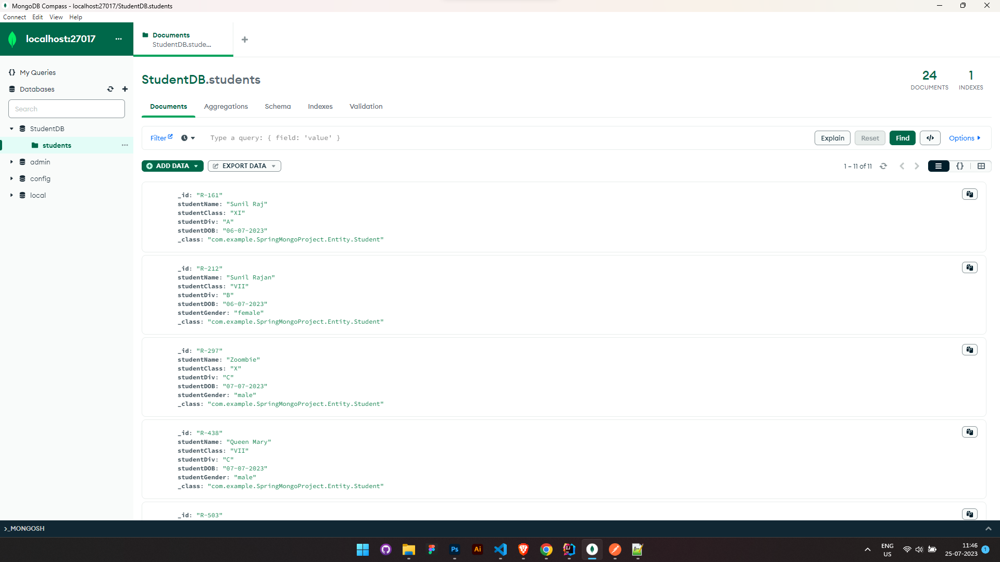

# FullStack-App-Project

A FullStack application created with ReactJS, SpringBoot and MongoDb.
<br>



## Installation - ReactJS
 
| **Tools Used** | **Version** |
| -------------- | ----------- |
| ReactJS        | 18.2.0      |
| Material UI    | 5.14.1      |
| Vite           | 4.4.5       |
| VS Code        | IDE         |

- #### Running Project
  
```cd mozan```<br>
```npm install```<br>
```npm run dev```

## Installation - SpringBoot
 
| **Tools Used**  | **Version** |
| --------------- | ----------- |
| IntelliJ IDEA   | 2023 1.4    |
| SpringBoot      | 3.1.2       |
| MongoDB Compass | 1.39.0      |
| JDK             | 18          |
| Postman         | API Testing |

- #### Running Project
  
- [x] Open the ```SpringMongoProject``` folder with IntelliJ Idea<br>
- [x] Run the Project 

- #### MongoDB




